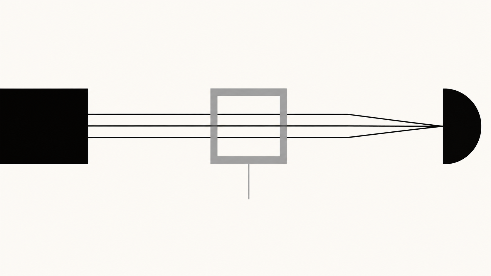

> **Atualização deste dossiê:** 3 de setembro de 2026, 16h (horário de Brasília). Como o caso está em rápida evolução, fatos posteriores a esse corte não estão incorporados.

<aside class="case-map">
  Mapa do caso
  

    
<strong>01 · Modelo financeiro</strong>
Captação cara, ativos difíceis de avaliar, FGC e a tentativa de venda ao BRB.

    
<strong>02 · Rede de acesso</strong>
Relações comerciais e políticas distribuídas entre partidos, governos e Poderes.

    
<strong>03 · Dark Horse</strong>
Financiamento do filme, fluxo internacional de recursos e participação da família Bolsonaro.

    
<strong>04 · Grau de prova</strong>
Separação entre fatos documentados, indícios investigados e afirmações ainda não demonstradas.

  

</aside>

---

## 1. Antes da política: que banco era o Master?

- Para entender por que Daniel Vorcaro precisava de relações políticas tão amplas, é preciso começar pelo desenho econômico do banco.

    Vorcaro assumiu o controle do antigo Banco Máxima em 2019 e o rebatizou como Banco Master em 2022. O crescimento posterior foi agressivo. Uma das principais ferramentas de captação eram CDBs com remuneração muito acima do padrão de bancos comparáveis. Reportagens registraram papéis chegando a **140% do CDI**, enquanto outros bancos médios ofereciam em torno de 115%.[^1] [Folha de S.Paulo ↗](https://www1.folha.uol.com.br/mercado/2025/10/negociacoes-de-cdbs-do-master-no-mercado-secundario-pressionam-fgc.shtml)

    Isso, por si só, não é crime. Bancos pequenos e arriscados precisam pagar mais para captar dinheiro. O problema aparece quando se combina:

    1. captação muito cara; [Contexto: Folha de S.Paulo ↗](https://www1.folha.uol.com.br/mercado/2025/10/negociacoes-de-cdbs-do-master-no-mercado-secundario-pressionam-fgc.shtml)
    2. ativos de longo prazo, ilíquidos ou de avaliação difícil; [Contexto: Folha de S.Paulo ↗](https://www1.folha.uol.com.br/mercado/2025/10/negociacoes-de-cdbs-do-master-no-mercado-secundario-pressionam-fgc.shtml)
    3. crescimento rápido; [Contexto: Folha de S.Paulo ↗](https://www1.folha.uol.com.br/mercado/2025/10/negociacoes-de-cdbs-do-master-no-mercado-secundario-pressionam-fgc.shtml)
    4. e a percepção do investidor de que, até determinado limite, o risco final seria absorvido pelo **Fundo Garantidor de Créditos — FGC**. [Contexto: Folha de S.Paulo ↗](https://www1.folha.uol.com.br/mercado/2025/10/negociacoes-de-cdbs-do-master-no-mercado-secundario-pressionam-fgc.shtml)

    O FGC não é dinheiro orçamentário da União, mas um fundo privado financiado pelas instituições participantes do sistema. Ainda assim, ele altera os incentivos econômicos. Se um investidor aceita um CDB de um banco muito arriscado porque sabe que até R$ 250 mil existe cobertura, o banco consegue captar recursos em volume muito maior do que conseguiria apenas com sua reputação. No caso Master, distribuidores e assessores chegaram a usar explicitamente a combinação “rentabilidade alta + cobertura do FGC” como argumento comercial.[^2] [Folha de S.Paulo ↗](https://www1.folha.uol.com.br/mercado/2025/11/apos-master-bc-quer-deixar-mais-clara-remuneracao-de-corretoras-na-venda-de-cdbs.shtml)

    A consequência é um problema clássico de **risco moral**: quem decide emprestar dinheiro ao banco pode ter menos incentivo para avaliar a qualidade dos ativos porque acredita estar protegido pelo fundo. Para o emissor, isso cria espaço para captar a taxas elevadas e tentar compensar o custo investindo em operações igualmente mais arriscadas.

    Quando o Banco Central decretou a liquidação do conglomerado em 18 de novembro de 2025, afirmou oficialmente que a medida foi motivada por **grave crise de liquidez**, comprometimento significativo da situação econômico-financeira e graves violações às normas do Sistema Financeiro Nacional.[^3] [Banco Central do Brasil ↗](https://www.bcb.gov.br/detalhenoticia/20936/nota) Estimativas posteriores apontaram que as liquidações do conglomerado poderiam gerar cerca de **R$ 51,8 bilhões** em ressarcimentos pelo FGC — o maior desembolso da história do fundo.[^4] [DIEESE ↗](https://www.dieese.org.br/notatecnica/2026/notaTec291BancoMaster/index.html)

    Esse ponto é decisivo: o Master não era apenas um banco com bons contatos. Era uma instituição cujo modelo econômico dependia de confiança contínua, captação permanente e capacidade de convencer investidores e autoridades de que seus ativos valiam o que os balanços afirmavam que valiam.

---

## 2. O BRB: a tentativa de transformar um problema privado em solução institucional

- Em março de 2025, o Banco de Brasília — BRB, controlado pelo governo do Distrito Federal — anunciou um acordo para adquirir **58% do capital total do Banco Master**, por uma operação estimada em cerca de R$ 2 bilhões.[^5] [Reuters/UOL ↗](https://economia.uol.com.br/noticias/reuters/2025/09/03/brb-diz-que-bc-indeferiu-aquisicao-do-banco-master.htm)

    A transação era potencialmente salvadora para o Master. Um banco público capitalizado absorveria parte importante da estrutura e daria ao grupo de Vorcaro um novo eixo de estabilidade. O problema é que o Banco Central já examinava operações envolvendo carteiras de crédito negociadas entre Master e BRB.

    A investigação que depois originou a Operação Compliance Zero passou a trabalhar com a suspeita de que o Master teria produzido ou adquirido **carteiras de crédito consignado sem lastro**, compostas por tomadores inexistentes, e repassado esses ativos ao BRB. Em novembro de 2025, a estimativa divulgada era de **R$ 12,2 bilhões** em carteiras de crédito inexistentes vendidas ao banco público.[^6] [UOL ↗](https://www.bol.uol.com.br/noticias/2025/11/18/documentos-falsos-e-fraude-de-r-122-bi-o-que-bc-mpf-e-pf-acharam-sobre-master-e-brb.htm)

    Segundo investigadores, a eventual incorporação do Master pelo BRB teria um efeito adicional: os ativos problemáticos poderiam se misturar ao balanço maior do banco público, dificultando a identificação do buraco como uma carteira específica.[^7] [Folha de S.Paulo ↗](https://www1.folha.uol.com.br/mercado/2025/11/investigacao-aponta-que-master-usou-negocio-com-brb-para-esconder-carteira-falsa-de-consignado.shtml)

    O Banco Central rejeitou a compra em **3 de setembro de 2025**.[^8] [Agência Brasil ↗](https://agenciabrasil.ebc.com.br/economia/noticia/2025-09/bc-rejeita-compra-do-master-pelo-banco-de-brasilia-brb) Pouco mais de dois meses depois, Vorcaro foi preso e o Master foi liquidado.

    A sequência temporal importa porque mostra que 2024 e 2025 foram anos em que Vorcaro tinha enorme incentivo para mobilizar acesso político, reputacional e institucional. Não é necessário pressupor uma grande conspiração coordenada. Para um banqueiro enfrentando risco regulatório, o simples fato de conhecer ministros, senadores, governadores, dirigentes partidários, ex-presidentes, membros do Judiciário e pessoas próximas ao Banco Central já tem valor econômico.

    É nesse cenário que a política deixa de ser uma história lateral e passa a fazer parte do caso.

---

## 3. O que a Compliance Zero passou a investigar

- A Operação Compliance Zero começou em novembro de 2025 com foco em fraudes contra o sistema financeiro, especialmente emissão e negociação de títulos de crédito falsos. Em fases posteriores, o escopo cresceu para corrupção, lavagem, organização criminosa, obtenção de informações sigilosas, invasões de dispositivos e intimidação de pessoas consideradas obstáculos aos interesses do grupo.[^9] [Polícia Federal/Agência Gov ↗](https://agenciagov.ebc.com.br/noticias/202605/pf-deflagra-6a-fase-da-operacao-compliance-zero)

    Isso ajuda a separar duas perguntas que frequentemente são misturadas:

    - **O banco fraudou ou mascarou ativos?** Esse é o núcleo financeiro da investigação. [Contexto: Polícia Federal/Agência Gov ↗](https://agenciagov.ebc.com.br/noticias/202605/pf-deflagra-6a-fase-da-operacao-compliance-zero)
    - **O banco pagava, presenteava ou contratava pessoas influentes para obter proteção ou decisões favoráveis?** Esse é o núcleo político-institucional. [Contexto: Polícia Federal/Agência Gov ↗](https://agenciagov.ebc.com.br/noticias/202605/pf-deflagra-6a-fase-da-operacao-compliance-zero)

    A existência de contratos ou relações com políticos não demonstra automaticamente corrupção. Empresas contratam ex-ministros, advogados e consultores. Políticos participam de eventos e empresários financiam projetos privados. O salto jurídico ocorre quando aparece **vantagem indevida vinculada a um ato funcional**, promessa de influência, intermediação ilícita ou ocultação da verdadeira finalidade de um pagamento.

    No caso Master, alguns núcleos têm apenas proximidade ou contratos declarados; outros já apresentam mensagens em que os investigadores dizem enxergar uma contrapartida concreta.

---

## 4. A melhor maneira de entender Vorcaro: não como “banqueiro de um partido”, mas como investidor em acesso

- Documentos fiscais enviados à CPI do Crime Organizado mostraram pagamentos do Master a uma lista politicamente heterogênea: empresas ou escritórios ligados a **Guido Mantega, Henrique Meirelles, Ricardo Lewandowski, Michel Temer, Antônio Rueda, ACM Neto, Marconi Perillo, Fabio Wajngarten** e outros.[^10] [Folha de S.Paulo ↗](https://www1.folha.uol.com.br/poder/2026/04/master-declarou-pagamentos-a-temer-rueda-mantega-lewandowski-e-acm-neto.shtml)

    Esse dado muda a leitura do caso. O padrão não é ideológico. É de **diversificação de acesso**.

    Um banqueiro pode querer portas abertas em quatro lugares diferentes ao mesmo tempo:

    - governo federal; [Contexto: Folha de S.Paulo ↗](https://www1.folha.uol.com.br/poder/2026/04/master-declarou-pagamentos-a-temer-rueda-mantega-lewandowski-e-acm-neto.shtml)
    - Congresso; [Contexto: Folha de S.Paulo ↗](https://www1.folha.uol.com.br/poder/2026/04/master-declarou-pagamentos-a-temer-rueda-mantega-lewandowski-e-acm-neto.shtml)
    - governos locais e bancos públicos; [Contexto: Folha de S.Paulo ↗](https://www1.folha.uol.com.br/poder/2026/04/master-declarou-pagamentos-a-temer-rueda-mantega-lewandowski-e-acm-neto.shtml)
    - Judiciário e sistema de Justiça. [Contexto: Folha de S.Paulo ↗](https://www1.folha.uol.com.br/poder/2026/04/master-declarou-pagamentos-a-temer-rueda-mantega-lewandowski-e-acm-neto.shtml)

    Se uma relação falha, outra pode funcionar. Se muda o governo, a rede continua útil. Isso explica por que tentar reduzir o Master a “caso do PT” ou “caso do bolsonarismo” é analiticamente pobre. Há relações relevantes com ambos — e com o Centrão, o MDB, o União Brasil, o PSDB e integrantes do Judiciário.

    A questão correta é: **qual foi a natureza de cada relação e existe evidência de contrapartida?**

---

# PARTE I — O EIXO PT / GOVERNO LULA

## 5. Lula recebeu Vorcaro no Planalto fora da agenda

- Em **4 de dezembro de 2024**, Lula recebeu Daniel Vorcaro no Palácio do Planalto em uma reunião que não constava da agenda oficial. Vorcaro foi levado pelo ex-ministro **Guido Mantega**; também participou Gabriel Galípolo, então indicado para assumir a presidência do Banco Central.[^11] [UOL ↗](https://noticias.uol.com.br/politica/ultimas-noticias/2026/01/26/lula-encontro-vorcaro-agenda-2024-galipolo.htm/)

    A reunião é politicamente relevante por três motivos.

    Primeiro, porque demonstra acesso ao nível máximo do Executivo. Segundo, porque o encontro ocorreu quando o Master já buscava soluções para sua situação financeira. Terceiro, porque a presença de Galípolo colocava na sala o futuro chefe da autoridade monetária responsável por supervisionar o banco.

    Mas o que a reunião **prova**?

    Prova que Vorcaro teve acesso a Lula e Galípolo. Não prova, sozinha, que Lula interveio em favor do banco. A versão divulgada pelo governo foi justamente a contrária: Lula teria ouvido Vorcaro e afirmado que as questões eram técnicas e deveriam ser tratadas pelo Banco Central.[^12] [CNN Brasil ↗](https://www.cnnbrasil.com.br/politica/lula-esteve-com-vorcaro-em-encontro-fora-da-agenda-em-dezembro-de-2024/)

    Mensagens posteriores atribuídas a Vorcaro mostram que ele considerou o encontro “ótimo” e relatou à namorada que Lula chamou Galípolo e ministros para a conversa.[^13] [Folha de S.Paulo ↗](https://www1.folha.uol.com.br/amp/mercado/2026/03/vorcaro-diz-em-mensagens-que-encontro-com-lula-foi-otimo.shtml) Isso mostra a percepção de Vorcaro de que a reunião foi positiva; não demonstra que tenha obtido uma decisão ilegal.

    Portanto, essa ponta deve ser classificada como **acesso político relevante, mas sem contrapartida ilícita demonstrada até o corte deste texto**.

---

## 6. Guido Mantega: R$ 14 milhões em consultoria e a ponte com Lula

- A relação com Mantega é mais concreta financeiramente. Dados fiscais divulgados pela imprensa indicam que o Master pagou **R$ 14 milhões** à Pollaris Consultoria, empresa do ex-ministro da Fazenda, entre 2024 e 2025.[^10] [Folha de S.Paulo ↗](https://www1.folha.uol.com.br/poder/2026/04/master-declarou-pagamentos-a-temer-rueda-mantega-lewandowski-e-acm-neto.shtml)

    Mantega afirma que prestou consultoria econômico-financeira e que não tinha conhecimento de irregularidades no banco. A contratação privada, isoladamente, é lícita.

    O que torna o episódio politicamente relevante é a combinação de duas funções exercidas por Mantega:

    1. ele era consultor remunerado do Master; [Contexto: Folha de S.Paulo ↗](https://www1.folha.uol.com.br/poder/2026/04/master-declarou-pagamentos-a-temer-rueda-mantega-lewandowski-e-acm-neto.shtml)
    2. foi ele quem levou Vorcaro ao encontro com Lula. [Contexto: Folha de S.Paulo ↗](https://www1.folha.uol.com.br/poder/2026/04/master-declarou-pagamentos-a-temer-rueda-mantega-lewandowski-e-acm-neto.shtml)

    Essa combinação não prova tráfico de influência. Para isso seria necessário demonstrar que o pagamento tinha como finalidade remunerar a influência de Mantega sobre agentes públicos ou obter ato funcional específico. Mas ela produz uma pergunta legítima: **a consultoria era apenas econômica ou o valor do ex-ministro também estava em sua capacidade de abrir portas?**

    Até agora, o que existe publicamente sustenta a pergunta, não uma conclusão penal.

---

## 7. Ricardo Lewandowski: contrato com o escritório e conflito institucional

- O Banco Master manteve contrato com o escritório da família de **Ricardo Lewandowski** de 2023 a agosto de 2025. Reportagens indicam remuneração de **R$ 250 mil mensais** e pelo menos R$ 6,1 milhões pagos ao escritório.[^14] [Folha de S.Paulo ↗](https://www1.folha.uol.com.br/mercado/2026/01/master-pagou-por-consultoria-de-escritorio-de-lewandowski-quando-ele-era-ministro-da-justica.shtml)

    Lewandowski deixou formalmente a banca ao assumir o Ministério da Justiça em fevereiro de 2024, suspendendo sua inscrição profissional. O escritório permaneceu sob comando de sua mulher e de seu filho e continuou atendendo o Master. Isso é relevante porque a **Polícia Federal é subordinada administrativamente ao Ministério da Justiça**, embora possua autonomia investigativa e não receba ordens ministeriais sobre inquéritos específicos.

    Há aqui um potencial conflito de aparência: a família do ministro recebia dinheiro de um banco que posteriormente se tornaria alvo de investigação da PF. Mas aparência de conflito não equivale a prova de interferência.

    Uma representação ao Tribunal de Contas da União pediu apuração do contrato. A área técnica do TCU recomendou o arquivamento por entender que não havia indícios suficientes de irregularidade dentro da competência do tribunal.[^15] [Folha de S.Paulo ↗](https://www1.folha.uol.com.br/blogs/brasilia-hoje/2026/04/tcu-rejeita-investigacao-sobre-contrato-do-master-com-escritorio-de-lewandowski.shtml)

    Outro detalhe relevante: segundo a Folha, **Jaques Wagner** foi quem indicou Lewandowski ao banco quando Vorcaro procurava um jurista.[^14] [Folha de S.Paulo ↗](https://www1.folha.uol.com.br/mercado/2026/01/master-pagou-por-consultoria-de-escritorio-de-lewandowski-quando-ele-era-ministro-da-justica.shtml) Assim, a conexão entre Master e Lewandowski também passa por um dos principais líderes do PT no Senado.

---

## 8. Jaques Wagner: o núcleo petista que ultrapassa simples proximidade

- A situação de **Jaques Wagner (PT-BA)** é juridicamente mais sensível porque a Polícia Federal não fala apenas em reuniões ou contratos de terceiros. Ela o descreveu como possível **“beneficiário central” de vantagens econômicas indevidas**.[^16] [UOL ↗](https://noticias.uol.com.br/politica/ultimas-noticias/2026/06/18/apartamento-shows-voos-em-jatinho-o-que-liga-wagner-e-master-segundo-pf.ghtm)

    Segundo a investigação, estruturas ligadas ao Master teriam proporcionado ao senador:

    - apartamento em Salvador avaliado em aproximadamente R$ 2,5 milhões; [Contexto: UOL ↗](https://noticias.uol.com.br/politica/ultimas-noticias/2026/06/18/apartamento-shows-voos-em-jatinho-o-que-liga-wagner-e-master-segundo-pf.ghtm)
    - voos em aeronaves ligadas a Augusto Lima, ex-sócio de Vorcaro; [Contexto: UOL ↗](https://noticias.uol.com.br/politica/ultimas-noticias/2026/06/18/apartamento-shows-voos-em-jatinho-o-que-liga-wagner-e-master-segundo-pf.ghtm)
    - estadias e viagens; [Contexto: UOL ↗](https://noticias.uol.com.br/politica/ultimas-noticias/2026/06/18/apartamento-shows-voos-em-jatinho-o-que-liga-wagner-e-master-segundo-pf.ghtm)
    - ingressos de alto valor para show internacional; [Contexto: UOL ↗](https://noticias.uol.com.br/politica/ultimas-noticias/2026/06/18/apartamento-shows-voos-em-jatinho-o-que-liga-wagner-e-master-segundo-pf.ghtm)
    - e cerca de R$ 3,5 milhões destinados a empresa ligada à família.[^16] [UOL ↗](https://noticias.uol.com.br/politica/ultimas-noticias/2026/06/18/apartamento-shows-voos-em-jatinho-o-que-liga-wagner-e-master-segundo-pf.ghtm)

    Relatórios posteriores detalharam, por exemplo, viagem à chamada Ilha da Paixão e ingressos para Taylor Swift.[^17] [CNN Brasil ↗](https://www.cnnbrasil.com.br/politica/de-voo-a-ilha-a-ingresso-para-show-pf-detalha-benesses-do-master-a-jaques/)

    Wagner nega irregularidades e já afirmou que sua relação com Vorcaro seria “praticamente zero”. Seu depoimento à PF foi adiado em agosto a pedido da defesa, que afirmou ainda não ter tido acesso integral ao material da investigação.[^18] [UOL/Agência Estado ↗](https://noticias.uol.com.br/ultimas-noticias/agencia-estado/2026/08/07/depoimento-de-jaques-wagner-a-pf-no-caso-master-e-adiado-a-pedido-da-defesa.amp.htm)

    Aqui a distinção jurídica é fundamental. Se os benefícios existiram, ainda é preciso responder: **qual era a contrapartida?** A corrupção não se completa apenas com um empresário pagando algo a um político; é preciso vincular a vantagem ao exercício da função pública, ainda que o ato pretendido não chegue a ser praticado.

    A investigação, portanto, está em um estágio mais grave do que o caso Lula/Vorcaro ou a consultoria de Mantega, mas ainda não equivale a condenação.

---

## 9. A empresa da nora de Wagner

- Documentos fiscais também registraram cerca de **R$ 12 milhões** pagos entre 2022 e 2025 à BN Financeira, empresa de Bonnie Bonilha, nora de Jaques Wagner.[^10] [Folha de S.Paulo ↗](https://www1.folha.uol.com.br/poder/2026/04/master-declarou-pagamentos-a-temer-rueda-mantega-lewandowski-e-acm-neto.shtml)

    A empresa afirma que prestou serviços de prospecção e indicação de operações e convênios de crédito público e privado, com emissão de nota fiscal, e nega qualquer irregularidade. Wagner também apareceu nos dados com R$ 289 mil como pessoa física, valor que disse corresponder a rendimento de aplicação financeira, e não pagamento do banco.[^10] [Folha de S.Paulo ↗](https://www1.folha.uol.com.br/poder/2026/04/master-declarou-pagamentos-a-temer-rueda-mantega-lewandowski-e-acm-neto.shtml)

    Esse dado deve ser tratado como **relação comercial documentada**, não como prova de corrupção. Ele ganha importância apenas quando colocado ao lado das demais suspeitas envolvendo o senador e sua família.

---

## 10. Então o Master era “do PT”?

- Não. [Contexto: Folha de S.Paulo ↗](https://www1.folha.uol.com.br/poder/2026/04/master-declarou-pagamentos-a-temer-rueda-mantega-lewandowski-e-acm-neto.shtml)

    Existe uma **relação documentada com figuras centrais do campo petista e do governo Lula**: encontro com Lula; contrato milionário com Mantega; contrato com escritório da família Lewandowski durante parte do período em que ele era ministro; indicação de Lewandowski por Wagner; investigação sobre vantagens a Wagner; pagamentos a empresa de sua nora.

    Isso é suficiente para rejeitar a narrativa de que o caso “não chega ao PT”. Chega.

    Mas é insuficiente para afirmar que **“o PT comandava o esquema do Master”** ou que Lula participou de fraude bancária. Essa afirmação exigiria evidências de coordenação, benefício partidário ou decisões públicas tomadas em troca de vantagens. O material público disponível até 3 de setembro de 2026 não autoriza esse salto.

---

# PARTE II — BOLSONARO, PL E DARK HORSE

## 11. A relação começa antes do filme: doações e aviões

- O ecossistema Vorcaro já alcançava o bolsonarismo em 2022.

    **Fabiano Zettel**, cunhado de Daniel Vorcaro e apontado em investigações como operador financeiro do grupo, doou **R$ 3 milhões** para a campanha presidencial de Jair Bolsonaro e **R$ 2 milhões** para Tarcísio de Freitas em 2022.[^19] [CNN Brasil ↗](https://www.cnnbrasil.com.br/politica/alvo-da-pf-doou-r-5-mi-para-campanhas-de-bolsonaro-e-tarcisio-em-2022/)

    Doação eleitoral declarada é legal. O dado demonstra proximidade financeira com o campo político, não compra de decisão.

    No mesmo ciclo eleitoral, **Nikolas Ferreira** utilizou durante cerca de dez dias um jato ligado a Vorcaro em uma caravana de apoio à reeleição de Bolsonaro, passando por capitais do Nordeste, Brasília e Minas Gerais.[^20] [Agência Brasil ↗](https://agenciabrasil.ebc.com.br/politica/noticia/2026-03/nikolas-ferreira-viajou-em-jato-de-vorcaro-na-campanha-de-2022)

    Em 2026, mensagens divulgadas pelo ICL e repercutidas por UOL e Folha trouxeram uma frase atribuída a Vorcaro sobre o deputado: **“Esse Nikolas, eu banquei todos os voos dele”**.[^21] [UOL ↗](https://noticias.uol.com.br/politica/ultimas-noticias/2026/09/03/vorcaro-nikolas-ferreira-mensagens-voos.ghtm) Nikolas admite ter usado a aeronave, mas afirma que não sabia que ela era ligada ao banqueiro e nega ter recebido dinheiro.

    O caso ganhou nova dimensão porque, em março de 2025, Nikolas enviou áudio a Vorcaro pedindo ajuda para um amigo e ex-assessor em um negócio envolvendo um **ativo minerário**.[^22] [Folha de S.Paulo ↗](https://www1.folha.uol.com.br/poder/2026/09/nikolas-pediu-ajuda-a-vorcaro-para-liberar-minerio-e-banqueiro-afirmou-bancar-voos-dele-diz-site.shtml) Não há confirmação pública de que o pedido tenha sido atendido nem demonstração de ato público praticado por Nikolas em contrapartida.

    A relevância é outra: o deputado que aparecia publicamente criticando eventos patrocinados pelo Master tinha, segundo as mensagens, uma relação privada suficientemente próxima para pedir ajuda ao banqueiro.

---

## 12. Dark Horse: a conexão financeira mais direta com a família Bolsonaro

- O núcleo *Dark Horse* é diferente de quase todas as outras relações políticas porque há documentação de **negociação direta de financiamento**, cronograma de desembolsos, comprovante de remessa e cobranças feitas por Flávio Bolsonaro.

    O filme é uma cinebiografia internacional de Jair Bolsonaro. Documentos obtidos pelo Intercept indicam orçamento na faixa de **US$ 23 milhões a US$ 26 milhões**.[^23] [Intercept Brasil ↗](https://www.intercept.com.br/2026/05/15/eduardo-bolsonaro-poder-dinheiro-dark-horse-contrato/)

    A relação com Vorcaro começou, segundo as mensagens, no fim de 2024.

    Em **8 de dezembro de 2024**, o empresário Thiago Miranda organizou um encontro entre Flávio Bolsonaro e Vorcaro para tratar do “filme do presidente”. Em 11 de dezembro, Mario Frias enviou a Vorcaro mensagem agradecendo pelo apoio ao projeto.[^24] [Intercept Brasil ↗](https://www.intercept.com.br/2026/05/13/audio-flavio-negociou-vorcaro-milhoes/)

    No início de 2025, as tratativas se transformaram em cobrança operacional. Em janeiro, mensagens mostram pressão para destravar contratos e iniciar aportes. Vorcaro passou a acompanhar o cronograma pessoalmente e classificou o pagamento do filme como **“o mais importante disparado”**.[^25] [Intercept Brasil ↗](https://www.intercept.com.br/2026/06/02/mais-importante-disparado-vorcaro-bolsonaro/)

    O valor negociado por Flávio com Vorcaro foi de aproximadamente **US$ 24 milhões**, então cerca de **R$ 134 milhões**.[^24] [Intercept Brasil ↗](https://www.intercept.com.br/2026/05/13/audio-flavio-negociou-vorcaro-milhoes/)

    Esse é o primeiro ponto que precisa ficar cristalino: não se trata de um banqueiro que espontaneamente comprou ingressos ou patrocinou um evento. Há evidência de uma **captação conduzida por Flávio Bolsonaro** para financiar um projeto diretamente ligado à imagem política de seu pai.

---

## 13. Para onde o dinheiro foi?

- As primeiras revelações documentaram pelo menos **US$ 10,6 milhões** — aproximadamente R$ 61 milhões à época — transferidos entre fevereiro e maio de 2025 em seis operações.[^24] [Intercept Brasil ↗](https://www.intercept.com.br/2026/05/13/audio-flavio-negociou-vorcaro-milhoes/)

    O dinheiro chegou ao **Havengate Development Fund LP**, fundo registrado no Texas e administrado por pessoas ligadas a Eduardo Bolsonaro, entre elas o advogado Paulo Calixto.[^26] [Folha de S.Paulo ↗](https://www1.folha.uol.com.br/poder/2026/05/fundo-nos-eua-do-caso-dark-horse-e-controlado-por-aliados-de-eduardo-bolsonaro.shtml)

    Parte das remessas passou pela **Entre Investimentos e Participações**. Em setembro de 2026, a PGR firmou acordo de colaboração premiada com Antônio Carlos Freixo Júnior, o “Mineiro”, dono de empresa apontada pela PF como braço operacional de Vorcaro e envolvida em transferências ao Havengate.[^27] [Folha de S.Paulo ↗](https://www1.folha.uol.com.br/poder/2026/09/pgr-fecha-delacao-com-empresario-que-fez-pagamentos-a-fundo-que-financiaria-dark-horse.shtml)

    A estrutura é importante porque coloca três camadas entre o banqueiro e a produção:

    - **Vorcaro / empresas associadas → Entre → Havengate → produção do filme.** [Contexto: Intercept Brasil ↗](https://www.intercept.com.br/2026/05/13/audio-flavio-negociou-vorcaro-milhoes/)

    Isso não significa, por si só, lavagem de dinheiro. Fundos e veículos de investimento são comuns em produções cinematográficas internacionais. A suspeita nasce da origem do dinheiro, da situação financeira do banco, do controle do fundo por aliados dos Bolsonaro e da possível utilização para despesas diferentes do filme.

---

## 14. Eduardo Bolsonaro não era apenas “a pessoa retratada”

- Depois das primeiras reportagens, Eduardo Bolsonaro minimizou sua participação financeira no projeto. Documentos revelados posteriormente, porém, mostraram que ele assinou contrato como **produtor-executivo** e tinha responsabilidades sobre orçamento e decisões financeiras.[^23] [Intercept Brasil ↗](https://www.intercept.com.br/2026/05/15/eduardo-bolsonaro-poder-dinheiro-dark-horse-contrato/)

    O contrato foi assinado por Eduardo em janeiro de 2024. Reportagens também identificaram mensagens em que ele sugeria maneiras de facilitar o envio de recursos e indicava pessoas disponíveis para reuniões sobre a operação.[^28] [Folha de S.Paulo ↗](https://www1.folha.uol.com.br/poder/2026/05/eduardo-bolsonaro-pediu-envio-do-maximo-possivel-de-recursos-para-dark-horse-diz-site.shtml)

    A PF passou então a investigar se parte do dinheiro enviado por Vorcaro ao Havengate poderia ter custeado **despesas pessoais de Eduardo nos Estados Unidos** ou outras ações de aliados de Bolsonaro junto ao governo americano.[^29] [Folha de S.Paulo ↗](https://www1.folha.uol.com.br/poder/2026/06/diretor-da-pf-defende-abertura-de-novo-inquerito-para-apurar-uso-de-recursos-no-caso-dark-horse.shtml)

    É crucial usar o tempo verbal correto: **a PF investiga**. Não há, até o corte deste texto, prova pública conclusiva de que dinheiro do Master tenha pago a residência ou despesas pessoais de Eduardo.

---

## 15. O valor conhecido aumentou: US$ 12,3 milhões

- Durante meses, o valor confirmado publicamente ficou em US$ 10,6 milhões. Isso mudou no início de setembro de 2026.

    A revista *piauí* revelou, com base em relatório do Coaf, que Vorcaro enviou **mais US$ 1.666.667 em 16 de setembro de 2025**, oito dias depois de uma cobrança de Flávio. Com essa parcela, o total documentado subiu para cerca de **US$ 12,3 milhões**, mais de R$ 65 milhões na cotação da época.[^30] [revista piauí ↗](https://piaui.uol.com.br/revista/240/caixa-preta-flavio-bolsonaro-vorcaro-dark-horse/)

    O achado é especialmente relevante porque contradiz a versão de que os repasses conhecidos haviam terminado em maio de 2025. A *piauí* também encontrou mensagem de 22 de outubro em que Thiago Miranda pergunta a Vorcaro se ele conseguiria liberar “as parcelas do filme”, sugerindo que o fluxo financeiro ainda estava ativo.[^30] [revista piauí ↗](https://piaui.uol.com.br/revista/240/caixa-preta-flavio-bolsonaro-vorcaro-dark-horse/)

    A diferença parece pequena perto dos US$ 24 milhões prometidos, mas muda a cronologia jurídica e política: **Vorcaro continuou financiando o projeto quando a crise do Master já era pública e depois de o Banco Central ter rejeitado a venda ao BRB**.

---

## 16. Flávio Bolsonaro cobrava pessoalmente

- Em 8 de setembro de 2025, poucos dias depois de o Banco Central vetar a compra do Master pelo BRB, Flávio enviou áudio a Vorcaro cobrando o saldo pendente e alertando que a produção poderia parar.[^24] [Intercept Brasil ↗](https://www.intercept.com.br/2026/05/13/audio-flavio-negociou-vorcaro-milhoes/)

    Em novembro, a proximidade aparece de forma ainda mais explícita. Flávio escreveu a Vorcaro que “tudo isso só está sendo possível por causa de você” e, em 16 de novembro — um dia antes da prisão do banqueiro — enviou mensagem chamando-o de “irmão” e dizendo que estaria com ele “sempre”.[^24] [Intercept Brasil ↗](https://www.intercept.com.br/2026/05/13/audio-flavio-negociou-vorcaro-milhoes/)

    Essas frases não provam corrupção. Elas provam algo anterior e necessário para qualquer análise séria: **a relação era pessoal, direta, financeira e persistente**.

    Isso contradiz declarações anteriores de Flávio, que em março de 2026 havia afirmado que a direita estava sendo falsamente vinculada ao Master e que doações relacionadas a Zettel ocorreram sem contato ou contrapartida.[^31] [CNN Brasil ↗](https://www.cnnbrasil.com.br/politica/a-cnn-flavio-diz-que-doacao-a-campanha-ligada-a-vorcaro-foi-sem-contato/)

---

## 17. “Mas era investimento privado num filme. Onde estaria o crime?”

- Esse é o melhor argumento defensivo e precisa ser levado a sério. [Contexto: Intercept Brasil ↗](https://www.intercept.com.br/2026/05/13/audio-flavio-negociou-vorcaro-milhoes/)

    Não é ilegal um empresário investir R$ 60 milhões, R$ 100 milhões ou R$ 130 milhões em um filme sobre um ex-presidente. Também não é ilegal um senador ajudar a captar investimento privado para uma produção de sua família, desde que não use indevidamente o cargo ou ofereça contrapartida pública.

    Portanto, **o financiamento do Dark Horse, isoladamente, não prova corrupção**.

    O problema jurídico depende de perguntas adicionais:

    1. **O dinheiro era realmente do investidor privado ou derivava de fraude bancária, desvio ou ativos sem lastro?** [Contexto: Intercept Brasil ↗](https://www.intercept.com.br/2026/05/13/audio-flavio-negociou-vorcaro-milhoes/)
    2. **O investimento tinha expectativa econômica real ou funcionava como transferência de patrimônio para beneficiar politicamente e pessoalmente os Bolsonaro?** [Contexto: Intercept Brasil ↗](https://www.intercept.com.br/2026/05/13/audio-flavio-negociou-vorcaro-milhoes/)
    3. **Flávio, Eduardo, Mario Frias ou outros agentes públicos ofereceram ou praticaram atos em favor de Vorcaro em troca do financiamento?** [Contexto: Intercept Brasil ↗](https://www.intercept.com.br/2026/05/13/audio-flavio-negociou-vorcaro-milhoes/)
    4. **Parte do dinheiro foi desviada do filme para despesas pessoais ou atividade política?** [Contexto: Intercept Brasil ↗](https://www.intercept.com.br/2026/05/13/audio-flavio-negociou-vorcaro-milhoes/)
    5. **Houve ocultação deliberada da origem, destino ou beneficiário final dos recursos?** [Contexto: Intercept Brasil ↗](https://www.intercept.com.br/2026/05/13/audio-flavio-negociou-vorcaro-milhoes/)

    É por isso que a expressão “foi só investimento privado” não encerra o caso. Ela responde apenas à pergunta mais superficial: **qual era a forma aparente do pagamento?** Corrupção e lavagem frequentemente usam contratos formalmente privados. O que importa é a causa real do pagamento e sua eventual contrapartida.

    Ao mesmo tempo, também seria errado afirmar que o simples tamanho do investimento ou a amizade entre Flávio e Vorcaro já demonstra suborno.

---

## 18. O fundo Havengate tinha uma história anterior ao filme

- Outro elemento que aumenta a necessidade de escrutínio é a história do Havengate. O fundo havia sido criado originalmente para captar recursos para um projeto imobiliário no Texas chamado **Havengate Community**, avaliado em cerca de US$ 21,1 milhões e associado à possibilidade de obtenção de green card por investidores. O projeto acabou não avançando como originalmente anunciado.[^32] [Intercept Brasil ↗](https://www.intercept.com.br/2026/07/02/fundo-havengate-abandonou-projeto-antes-milhoes-vorcaro-dark-horse/)

    Depois, o mesmo veículo recebeu milhões de dólares relacionados a *Dark Horse*.

    Essa mudança de finalidade não é automaticamente irregular. Fundos podem alterar estratégias. Mas, combinada com a proximidade entre seus controladores e Eduardo Bolsonaro, ela reforça a necessidade de rastrear o caminho do dinheiro e os beneficiários finais.

---

## 19. A prestação de contas continua insuficiente

- Em agosto de 2026, perícia contratada pela própria produtora Go Up afirmou que o filme custou cerca de **R$ 75 milhões**, sendo aproximadamente R$ 54 milhões gastos nos Estados Unidos e R$ 20,9 milhões no Brasil. O relatório declarou que 100% do aporte teria vindo do Havengate, mas não identificou individualmente os investidores responsáveis.[^33] [CNN Brasil ↗](https://www.cnnbrasil.com.br/politica/dark-horse-pericia-diz-que-mais-de-70-dos-recursos-foram-gastos-nos-eua/)

    A Folha apontou que, meses depois das primeiras revelações, ainda não havia prestação de contas pública completa nem contrato de investimento divulgado, e que o laudo privado não detalhava fornecedores e documentos fiscais em nível suficiente para eliminar as dúvidas.[^34] [Folha de S.Paulo ↗](https://www1.folha.uol.com.br/poder/2026/08/dark-horse-tem-contradicoes-para-justificar-dinheiro-de-vorcaro-e-falta-de-prestacao-de-contas.shtml)

    Essa é uma das razões pelas quais o caso continua aberto: a cadeia “Vorcaro → fundo → produção → destinatários finais” ainda não está integralmente transparente para o público.

---

# PARTE III — A PONTE ENTRE DINHEIRO E PODER LEGISLATIVO

## 20. Ciro Nogueira e a “Emenda Master”: onde a suspeita de contrapartida é muito mais concreta

- O caso de **Ciro Nogueira (PP-PI)** é um dos episódios mais importantes para entender a diferença entre “relação” e “possível corrupção”.

    Em 13 de agosto de 2024, Ciro apresentou a **Emenda nº 11 à PEC 65/2023**, propondo elevar a cobertura ordinária do FGC de **R$ 250 mil para R$ 1 milhão**.[^35] [Senado Federal ↗](https://legis.senado.leg.br/sdleg-getter/documento?dm=9774194&ts=1729840562268)

    A medida beneficiaria especialmente bancos pequenos e médios que captavam agressivamente via CDB coberto pelo fundo — exatamente o modelo do Master.

    Em maio de 2026, a Polícia Federal afirmou ter encontrado no celular de Vorcaro mensagens indicando que a **assessoria do próprio Banco Master redigiu o texto da emenda**, que teria sido impresso, colocado em envelope e enviado ao endereço de Ciro. Depois que o texto foi apresentado, Vorcaro escreveu que a proposta havia saído “exatamente como mandei”.[^36] [UOL/Agência Estado ↗](https://noticias.uol.com.br/ultimas-noticias/agencia-estado/2026/05/07/pf-vorcaro-entregou-envelope-para-ciro-nogueira-com-texto-de-emenda-para-favorecer-master.amp.htm)

    A investigação acrescenta um segundo elemento: mensagens sobre pagamentos mensais de **R$ 300 mil a R$ 500 mil** ligados a uma estrutura entre empresas das famílias de Vorcaro e de Ciro. A PF apura cerca de **R$ 18 milhões** em suposta propina.[^37] [UOL ↗](https://noticias.uol.com.br/colunas/fabio-serapiao/2026/05/07/500k-ou-pago-300k-veja-mensagens-sobre-propina-para-ciro-nogueira.htm)

    Ciro nega ter recebido pagamentos ilícitos e nega que a proposta tenha sido redigida pelo banco; chegou a dizer que pretendia reapresentar a ideia por considerá-la benéfica aos depositantes.[^38] [Folha de S.Paulo ↗](https://www1.folha.uol.com.br/mercado/2026/05/ciro-nogueira-nega-que-emenda-master-tenha-sido-redigida-por-banco-e-diz-que-vai-reapresentar-proposta.shtml)

    Este núcleo é qualitativamente diferente do encontro de Lula com Vorcaro ou da contratação de Mantega. Aqui os investigadores afirmam possuir os dois lados que uma hipótese de corrupção precisa procurar:

    - **vantagem econômica**; [Contexto: Senado Federal ↗](https://legis.senado.leg.br/sdleg-getter/documento?dm=9774194&ts=1729840562268)
    - **ato parlamentar concretamente alinhado ao interesse privado**. [Contexto: Senado Federal ↗](https://legis.senado.leg.br/sdleg-getter/documento?dm=9774194&ts=1729840562268)

    Ainda falta julgamento e contraditório completo. Mas, como estrutura probatória, é uma das pontas mais fortes do caso.

---

# PARTE IV — JUDICIÁRIO E SISTEMA DE JUSTIÇA

## 21. Alexandre de Moraes: contratos, encontros e mensagens

- Em 2026, o caso Master atingiu também o STF. O escritório de **Viviane Barci de Moraes**, esposa do ministro Alexandre de Moraes, tinha contrato milionário com o banco. Reportagens e relatório policial apontaram que um contrato previa pagamentos de cerca de **R$ 3 milhões mensais**, e metadados de arquivos indicaram que o próprio ministro teria editado versão de uma minuta.[^39] [UOL ↗](https://noticias.uol.com.br/politica/ultimas-noticias/2026/09/01/moraes-editou-contrato-de-r-131-mi-do-escritorio-da-esposa-com-vorcaro.ghtm)

    O escritório afirma que consultou Moraes apenas sobre impedimentos legais e que o ministro nunca julgou processos envolvendo o Master.

    A situação tornou-se muito mais grave quando mensagens extraídas do celular de Vorcaro passaram a ser interpretadas pela PF como comunicações dirigidas ao ministro. Segundo a investigação, Vorcaro buscava informação e ajuda para conter investigações da PF e da PGR, perguntando inclusive, dias antes de ser preso, se deveria deixar o país.[^40] [UOL ↗](https://noticias.uol.com.br/politica/ultimas-noticias/2026/09/01/mensagens-vorcaro-moraes.ghtm)

    A PF identificou referências a pelo menos seis encontros entre ambos desde 2023 e investiga se houve tentativa de interferência em órgãos públicos.[^41] [UOL ↗](https://noticias.uol.com.br/colunas/artur-rodrigues/2026/09/01/mencoes-a-encontros-entre-moraes-e-vorcaro-vao-de-2023-a-vespera-da-prisao.ghtm)

    Essas mensagens não equivalem automaticamente a prova de que Moraes efetivamente interferiu. A própria discussão processual sobre a validade do relatório e a forma como André Mendonça conduziu a apuração permanece aberta. Mas o conjunto — relação pessoal, contrato familiar, edição de minuta atribuída ao ministro e pedidos de ajuda de Vorcaro — cria um conflito de interesse muito mais sério do que uma relação social ordinária.

---

## 22. O caso mostra uma estratégia de proximidade, não fidelidade ideológica

- Quando se colocam lado a lado os eixos, aparece um padrão: [Contexto: UOL ↗](https://noticias.uol.com.br/politica/ultimas-noticias/2026/09/01/moraes-editou-contrato-de-r-131-mi-do-escritorio-da-esposa-com-vorcaro.ghtm)

    - Mantega abre porta para Lula; [Contexto: UOL ↗](https://noticias.uol.com.br/politica/ultimas-noticias/2026/09/01/moraes-editou-contrato-de-r-131-mi-do-escritorio-da-esposa-com-vorcaro.ghtm)
    - Wagner aparece como ponte para Lewandowski e depois como investigado por vantagens; [Contexto: UOL ↗](https://noticias.uol.com.br/politica/ultimas-noticias/2026/09/01/moraes-editou-contrato-de-r-131-mi-do-escritorio-da-esposa-com-vorcaro.ghtm)
    - Ciro apresenta emenda que, segundo a PF, foi redigida pelo Master; [Contexto: UOL ↗](https://noticias.uol.com.br/politica/ultimas-noticias/2026/09/01/moraes-editou-contrato-de-r-131-mi-do-escritorio-da-esposa-com-vorcaro.ghtm)
    - Flávio capta dezenas de milhões para o filme do pai; [Contexto: UOL ↗](https://noticias.uol.com.br/politica/ultimas-noticias/2026/09/01/moraes-editou-contrato-de-r-131-mi-do-escritorio-da-esposa-com-vorcaro.ghtm)
    - Eduardo ocupa posição de produtor-executivo e pessoas ligadas a ele controlam o fundo receptor; [Contexto: UOL ↗](https://noticias.uol.com.br/politica/ultimas-noticias/2026/09/01/moraes-editou-contrato-de-r-131-mi-do-escritorio-da-esposa-com-vorcaro.ghtm)
    - Nikolas utiliza aeronave ligada a Vorcaro e posteriormente pede ajuda em assunto privado; [Contexto: UOL ↗](https://noticias.uol.com.br/politica/ultimas-noticias/2026/09/01/moraes-editou-contrato-de-r-131-mi-do-escritorio-da-esposa-com-vorcaro.ghtm)
    - ex-ministros, advogados e dirigentes de vários partidos recebem contratos; [Contexto: UOL ↗](https://noticias.uol.com.br/politica/ultimas-noticias/2026/09/01/moraes-editou-contrato-de-r-131-mi-do-escritorio-da-esposa-com-vorcaro.ghtm)
    - Moraes e sua família mantêm relação contratual e pessoal com o banqueiro enquanto o banco enfrenta crescente pressão institucional. [Contexto: UOL ↗](https://noticias.uol.com.br/politica/ultimas-noticias/2026/09/01/moraes-editou-contrato-de-r-131-mi-do-escritorio-da-esposa-com-vorcaro.ghtm)

    Isso é mais bem descrito como uma **estratégia de aquisição de acesso** do que como aliança partidária.

    O banqueiro não precisava que todos os contatos praticassem crimes. Para sua posição econômica, já era valioso que dezenas de pessoas importantes o conhecessem, atendessem suas ligações, aceitassem reuniões, participassem de eventos, prestassem consultoria ou o apresentassem a outras autoridades.

    A influência política é muitas vezes acumulativa. Cada vínculo isolado pode ser explicável. O problema surge quando o conjunto forma uma infraestrutura informal de acesso ao Estado.

---

# PARTE V — O QUE É FATO, O QUE É INDÍCIO E O QUE AINDA NÃO ESTÁ PROVADO

## 23. Fatos documentados com alto grau de segurança

- Até 3 de setembro de 2026, é possível afirmar com segurança que: [Contexto: UOL ↗](https://noticias.uol.com.br/politica/ultimas-noticias/2026/09/01/moraes-editou-contrato-de-r-131-mi-do-escritorio-da-esposa-com-vorcaro.ghtm)

    - o Master captou recursos oferecendo CDBs com remuneração muito superior à média e explorando comercialmente a cobertura do FGC; [Contexto: UOL ↗](https://noticias.uol.com.br/politica/ultimas-noticias/2026/09/01/moraes-editou-contrato-de-r-131-mi-do-escritorio-da-esposa-com-vorcaro.ghtm)
    - o Banco Central liquidou o conglomerado por crise de liquidez, comprometimento econômico-financeiro e violações regulatórias; [Contexto: UOL ↗](https://noticias.uol.com.br/politica/ultimas-noticias/2026/09/01/moraes-editou-contrato-de-r-131-mi-do-escritorio-da-esposa-com-vorcaro.ghtm)
    - o BRB tentou comprar 58% do capital do Master e o Banco Central vetou a operação; [Contexto: UOL ↗](https://noticias.uol.com.br/politica/ultimas-noticias/2026/09/01/moraes-editou-contrato-de-r-131-mi-do-escritorio-da-esposa-com-vorcaro.ghtm)
    - investigações identificaram carteiras de crédito consideradas inexistentes ou sem lastro vendidas ao BRB; [Contexto: UOL ↗](https://noticias.uol.com.br/politica/ultimas-noticias/2026/09/01/moraes-editou-contrato-de-r-131-mi-do-escritorio-da-esposa-com-vorcaro.ghtm)
    - Vorcaro manteve relações comerciais ou pessoais com agentes de vários partidos e Poderes; [Contexto: UOL ↗](https://noticias.uol.com.br/politica/ultimas-noticias/2026/09/01/moraes-editou-contrato-de-r-131-mi-do-escritorio-da-esposa-com-vorcaro.ghtm)
    - Mantega recebeu R$ 14 milhões em consultoria e levou Vorcaro a uma reunião com Lula; [Contexto: UOL ↗](https://noticias.uol.com.br/politica/ultimas-noticias/2026/09/01/moraes-editou-contrato-de-r-131-mi-do-escritorio-da-esposa-com-vorcaro.ghtm)
    - o escritório da família Lewandowski recebeu milhões do Master; [Contexto: UOL ↗](https://noticias.uol.com.br/politica/ultimas-noticias/2026/09/01/moraes-editou-contrato-de-r-131-mi-do-escritorio-da-esposa-com-vorcaro.ghtm)
    - a PF investiga Jaques Wagner por supostas vantagens econômicas; [Contexto: UOL ↗](https://noticias.uol.com.br/politica/ultimas-noticias/2026/09/01/moraes-editou-contrato-de-r-131-mi-do-escritorio-da-esposa-com-vorcaro.ghtm)
    - Flávio Bolsonaro negociou financiamento de aproximadamente US$ 24 milhões para *Dark Horse*; [Contexto: UOL ↗](https://noticias.uol.com.br/politica/ultimas-noticias/2026/09/01/moraes-editou-contrato-de-r-131-mi-do-escritorio-da-esposa-com-vorcaro.ghtm)
    - pelo menos US$ 12,3 milhões em repasses relacionados ao projeto já foram documentados; [Contexto: UOL ↗](https://noticias.uol.com.br/politica/ultimas-noticias/2026/09/01/moraes-editou-contrato-de-r-131-mi-do-escritorio-da-esposa-com-vorcaro.ghtm)
    - Eduardo Bolsonaro assinou contrato como produtor-executivo; [Contexto: UOL ↗](https://noticias.uol.com.br/politica/ultimas-noticias/2026/09/01/moraes-editou-contrato-de-r-131-mi-do-escritorio-da-esposa-com-vorcaro.ghtm)
    - o Havengate, fundo receptor, é administrado por pessoas ligadas a Eduardo; [Contexto: UOL ↗](https://noticias.uol.com.br/politica/ultimas-noticias/2026/09/01/moraes-editou-contrato-de-r-131-mi-do-escritorio-da-esposa-com-vorcaro.ghtm)
    - a PF apura se recursos foram usados para despesas pessoais ou políticas diferentes da produção; [Contexto: UOL ↗](https://noticias.uol.com.br/politica/ultimas-noticias/2026/09/01/moraes-editou-contrato-de-r-131-mi-do-escritorio-da-esposa-com-vorcaro.ghtm)
    - a PF afirma que a emenda de Ciro Nogueira sobre o FGC foi redigida pelo Master e investiga pagamentos ao senador; [Contexto: UOL ↗](https://noticias.uol.com.br/politica/ultimas-noticias/2026/09/01/moraes-editou-contrato-de-r-131-mi-do-escritorio-da-esposa-com-vorcaro.ghtm)
    - o escritório da esposa de Moraes recebeu pagamentos milionários do Master e a PF analisa mensagens de Vorcaro atribuídas a contatos com o ministro. [Contexto: UOL ↗](https://noticias.uol.com.br/politica/ultimas-noticias/2026/09/01/moraes-editou-contrato-de-r-131-mi-do-escritorio-da-esposa-com-vorcaro.ghtm)

---

## 24. Indícios fortes, mas ainda dependentes de prova e julgamento

- Há base relevante para investigar: [Contexto: UOL ↗](https://noticias.uol.com.br/politica/ultimas-noticias/2026/09/01/moraes-editou-contrato-de-r-131-mi-do-escritorio-da-esposa-com-vorcaro.ghtm)

    - se Ciro Nogueira recebeu vantagem em troca de atuação legislativa; [Contexto: UOL ↗](https://noticias.uol.com.br/politica/ultimas-noticias/2026/09/01/moraes-editou-contrato-de-r-131-mi-do-escritorio-da-esposa-com-vorcaro.ghtm)
    - se Jaques Wagner recebeu benefícios vinculados a atos públicos favoráveis ao banco; [Contexto: UOL ↗](https://noticias.uol.com.br/politica/ultimas-noticias/2026/09/01/moraes-editou-contrato-de-r-131-mi-do-escritorio-da-esposa-com-vorcaro.ghtm)
    - se contratos de consultoria serviam, total ou parcialmente, para comprar influência política; [Contexto: UOL ↗](https://noticias.uol.com.br/politica/ultimas-noticias/2026/09/01/moraes-editou-contrato-de-r-131-mi-do-escritorio-da-esposa-com-vorcaro.ghtm)
    - se o financiamento de *Dark Horse* tinha finalidade econômica genuína ou funcionava como transferência de vantagem a uma família política; [Contexto: UOL ↗](https://noticias.uol.com.br/politica/ultimas-noticias/2026/09/01/moraes-editou-contrato-de-r-131-mi-do-escritorio-da-esposa-com-vorcaro.ghtm)
    - se dinheiro do filme financiou despesas pessoais de Eduardo Bolsonaro; [Contexto: UOL ↗](https://noticias.uol.com.br/politica/ultimas-noticias/2026/09/01/moraes-editou-contrato-de-r-131-mi-do-escritorio-da-esposa-com-vorcaro.ghtm)
    - se Alexandre de Moraes interveio em órgãos de investigação ou regulação a pedido de Vorcaro; [Contexto: UOL ↗](https://noticias.uol.com.br/politica/ultimas-noticias/2026/09/01/moraes-editou-contrato-de-r-131-mi-do-escritorio-da-esposa-com-vorcaro.ghtm)
    - se estruturas financeiras vinculadas ao Master foram usadas para ocultar destinatários ou origem de recursos. [Contexto: UOL ↗](https://noticias.uol.com.br/politica/ultimas-noticias/2026/09/01/moraes-editou-contrato-de-r-131-mi-do-escritorio-da-esposa-com-vorcaro.ghtm)

---

## 25. Afirmações que o material público ainda não permite fazer com responsabilidade

- Não está demonstrado, apenas com o que é público, que: [Contexto: UOL ↗](https://noticias.uol.com.br/politica/ultimas-noticias/2026/09/01/moraes-editou-contrato-de-r-131-mi-do-escritorio-da-esposa-com-vorcaro.ghtm)

    - Lula recebeu dinheiro do Master; [Contexto: UOL ↗](https://noticias.uol.com.br/politica/ultimas-noticias/2026/09/01/moraes-editou-contrato-de-r-131-mi-do-escritorio-da-esposa-com-vorcaro.ghtm)
    - Lula ordenou ao Banco Central que favorecesse Vorcaro; [Contexto: UOL ↗](https://noticias.uol.com.br/politica/ultimas-noticias/2026/09/01/moraes-editou-contrato-de-r-131-mi-do-escritorio-da-esposa-com-vorcaro.ghtm)
    - o PT, enquanto partido, coordenou o esquema; [Contexto: UOL ↗](https://noticias.uol.com.br/politica/ultimas-noticias/2026/09/01/moraes-editou-contrato-de-r-131-mi-do-escritorio-da-esposa-com-vorcaro.ghtm)
    - Jair Bolsonaro recebeu pessoalmente o dinheiro de *Dark Horse*; [Contexto: UOL ↗](https://noticias.uol.com.br/politica/ultimas-noticias/2026/09/01/moraes-editou-contrato-de-r-131-mi-do-escritorio-da-esposa-com-vorcaro.ghtm)
    - todo o dinheiro enviado ao Havengate foi desviado; [Contexto: UOL ↗](https://noticias.uol.com.br/politica/ultimas-noticias/2026/09/01/moraes-editou-contrato-de-r-131-mi-do-escritorio-da-esposa-com-vorcaro.ghtm)
    - Eduardo Bolsonaro usou comprovadamente recursos do Master para pagar sua mansão ou custo de vida nos EUA; [Contexto: UOL ↗](https://noticias.uol.com.br/politica/ultimas-noticias/2026/09/01/moraes-editou-contrato-de-r-131-mi-do-escritorio-da-esposa-com-vorcaro.ghtm)
    - todo contrato de consultoria do Master era falso; [Contexto: UOL ↗](https://noticias.uol.com.br/politica/ultimas-noticias/2026/09/01/moraes-editou-contrato-de-r-131-mi-do-escritorio-da-esposa-com-vorcaro.ghtm)
    - toda autoridade que participou de evento patrocinado pelo banco foi corrompida; [Contexto: UOL ↗](https://noticias.uol.com.br/politica/ultimas-noticias/2026/09/01/moraes-editou-contrato-de-r-131-mi-do-escritorio-da-esposa-com-vorcaro.ghtm)
    - a relação de Moraes com Vorcaro, por si só, já configura corrupção sem investigação da eventual contrapartida funcional. [Contexto: UOL ↗](https://noticias.uol.com.br/politica/ultimas-noticias/2026/09/01/moraes-editou-contrato-de-r-131-mi-do-escritorio-da-esposa-com-vorcaro.ghtm)

    Essa lista é tão importante quanto a lista de suspeitas. Um bom dossiê não fica mais forte exagerando. Fica mais forte deixando claro onde a evidência termina.

---

# PARTE VI — COMO AS PEÇAS SE ENCAIXAM

## 26. A hipótese estrutural mais plausível

- O que une FGC, BRB, Dark Horse e política é a necessidade de **sustentar um sistema financeiro que dependia de confiança**. [Contexto: UOL ↗](https://noticias.uol.com.br/politica/ultimas-noticias/2026/09/01/moraes-editou-contrato-de-r-131-mi-do-escritorio-da-esposa-com-vorcaro.ghtm)

    O Master captava caro. Para pagar essa captação, precisava que seus ativos rendessem muito e fossem aceitos pelo mercado e pelos reguladores. Quanto mais crescia, maior a necessidade de liquidez. Quando surgiam dúvidas sobre a qualidade dos ativos, uma solução como a venda ao BRB tornava-se existencial.

    Nesse tipo de ambiente, acesso político vale dinheiro.

    Um ex-ministro pode abrir reunião. Um senador pode propor norma. Um escritório influente pode dar prestígio e interlocução institucional. Um evento com ministros do Supremo produz reputação. Um banco público pode oferecer uma saída societária. Um projeto audiovisual ligado a uma família política pode transformar dinheiro em proximidade e gratidão.

    Isso não significa que cada pessoa tenha integrado uma organização criminosa. Significa que, para Vorcaro, **relações eram ativos**.

    A frase que sintetiza o caso talvez não seja “o Master comprou o PT” ou “o Master financiou Bolsonaro”. É algo mais incômodo:

<aside class="scholium">
  Escólio
  
<strong>O Master parece ter construído um portfólio de dependências, favores, contratos e acessos distribuído por todo o sistema político.</strong>

</aside>

- A investigação criminal precisa descobrir quais dessas relações eram apenas negócios, quais eram lobby, quais eram influência legítima e quais cruzaram a linha para corrupção. [Contexto: UOL ↗](https://noticias.uol.com.br/politica/ultimas-noticias/2026/09/01/moraes-editou-contrato-de-r-131-mi-do-escritorio-da-esposa-com-vorcaro.ghtm)

---

## 27. Onde Dark Horse se encaixa nessa hipótese

- *Dark Horse* é importante não porque seja a única relação política de Vorcaro, mas porque oferece uma janela rara sobre **como uma relação era construída**. [Contexto: UOL ↗](https://noticias.uol.com.br/politica/ultimas-noticias/2026/09/01/moraes-editou-contrato-de-r-131-mi-do-escritorio-da-esposa-com-vorcaro.ghtm)

    Há um pedido. Há um projeto que interessa pessoal e politicamente a uma família. Há cronograma. Há pressão por pagamentos. Há frases de gratidão. Há o banqueiro priorizando o desembolso. Há um fundo ligado a aliados do beneficiário. Há remessas internacionais. Há cobranças mesmo quando o banco enfrenta crise. Há contato pessoal até a véspera da prisão.

    Essa sequência é muito mais informativa do que uma fotografia em jantar.

    Ela ainda não fornece, sozinha, a peça que transformaria o caso em corrupção: **a contrapartida funcional específica**. Mas mostra com grande nitidez o tipo de vínculo que pode tornar uma contrapartida plausível e investigável.

    O caso Ciro Nogueira é justamente o contraponto: ali, segundo a PF, existe um possível pagamento e existe um ato legislativo cujo texto teria saído do próprio banco. É por isso que juridicamente o núcleo Ciro é, hoje, mais próximo de uma estrutura clássica de corrupção do que *Dark Horse* isoladamente.

    O núcleo *Dark Horse*, por sua vez, pode migrar de “financiamento privado politicamente problemático” para crime se a investigação demonstrar uma das seguintes pontes: origem ilícita dos recursos, desvio para benefício pessoal, ocultação, ato de ofício em favor do banco ou promessa de influência pública em troca do financiamento.

---

## 28. E a comparação PT versus Bolsonaro?

- A comparação mais rigorosa não é “quem recebeu mais dinheiro”, porque os pagamentos têm naturezas diferentes. [Contexto: UOL ↗](https://noticias.uol.com.br/politica/ultimas-noticias/2026/09/01/moraes-editou-contrato-de-r-131-mi-do-escritorio-da-esposa-com-vorcaro.ghtm)

    No **campo petista**, há:

    - acesso direto a Lula; [Contexto: UOL ↗](https://noticias.uol.com.br/politica/ultimas-noticias/2026/09/01/moraes-editou-contrato-de-r-131-mi-do-escritorio-da-esposa-com-vorcaro.ghtm)
    - consultoria milionária de Mantega; [Contexto: UOL ↗](https://noticias.uol.com.br/politica/ultimas-noticias/2026/09/01/moraes-editou-contrato-de-r-131-mi-do-escritorio-da-esposa-com-vorcaro.ghtm)
    - contrato da família Lewandowski; [Contexto: UOL ↗](https://noticias.uol.com.br/politica/ultimas-noticias/2026/09/01/moraes-editou-contrato-de-r-131-mi-do-escritorio-da-esposa-com-vorcaro.ghtm)
    - suspeitas de vantagens a Jaques Wagner; [Contexto: UOL ↗](https://noticias.uol.com.br/politica/ultimas-noticias/2026/09/01/moraes-editou-contrato-de-r-131-mi-do-escritorio-da-esposa-com-vorcaro.ghtm)
    - pagamentos a empresa de sua nora. [Contexto: UOL ↗](https://noticias.uol.com.br/politica/ultimas-noticias/2026/09/01/moraes-editou-contrato-de-r-131-mi-do-escritorio-da-esposa-com-vorcaro.ghtm)

    No **campo bolsonarista**, há:

    - doação eleitoral relevante de Zettel; [Contexto: UOL ↗](https://noticias.uol.com.br/politica/ultimas-noticias/2026/09/01/moraes-editou-contrato-de-r-131-mi-do-escritorio-da-esposa-com-vorcaro.ghtm)
    - uso de aeronave ligada a Vorcaro em campanha; [Contexto: UOL ↗](https://noticias.uol.com.br/politica/ultimas-noticias/2026/09/01/moraes-editou-contrato-de-r-131-mi-do-escritorio-da-esposa-com-vorcaro.ghtm)
    - pedidos privados de Nikolas; [Contexto: UOL ↗](https://noticias.uol.com.br/politica/ultimas-noticias/2026/09/01/moraes-editou-contrato-de-r-131-mi-do-escritorio-da-esposa-com-vorcaro.ghtm)
    - captação direta de dezenas de milhões por Flávio; [Contexto: UOL ↗](https://noticias.uol.com.br/politica/ultimas-noticias/2026/09/01/moraes-editou-contrato-de-r-131-mi-do-escritorio-da-esposa-com-vorcaro.ghtm)
    - participação financeira e executiva de Eduardo em *Dark Horse*; [Contexto: UOL ↗](https://noticias.uol.com.br/politica/ultimas-noticias/2026/09/01/moraes-editou-contrato-de-r-131-mi-do-escritorio-da-esposa-com-vorcaro.ghtm)
    - vínculos de Mario Frias e outros aliados com o projeto. [Contexto: UOL ↗](https://noticias.uol.com.br/politica/ultimas-noticias/2026/09/01/moraes-editou-contrato-de-r-131-mi-do-escritorio-da-esposa-com-vorcaro.ghtm)

    No **Centrão e demais partidos**, aparecem Ciro Nogueira, Antônio Rueda, Michel Temer, ACM Neto, Marconi Perillo e outros.

    No **Judiciário e sistema de Justiça**, aparecem contratos e relações com famílias e intermediários ligados a ministros e autoridades.

    Portanto, a conclusão não é que “todos são iguais” — os fatos e a força probatória variam muito. A conclusão é que **o método de Vorcaro era transversal**.

---

## 29. A pergunta que deve orientar a investigação daqui para frente

- A pergunta mais útil não é “Vorcaro conhecia fulano?”. Ele conhecia muita gente. [Contexto: UOL ↗](https://noticias.uol.com.br/politica/ultimas-noticias/2026/09/01/moraes-editou-contrato-de-r-131-mi-do-escritorio-da-esposa-com-vorcaro.ghtm)

    Também não basta perguntar “fulano recebeu dinheiro?”. Advogados, consultores e fornecedores recebem dinheiro legitimamente.

    A pergunta decisiva é:

<aside class="scholium">
  Escólio
  
<strong>Qual vantagem foi dada, a quem, por qual veículo, em que momento, e qual decisão ou influência pública Vorcaro esperava receber em troca?</strong>

</aside>

- Essa fórmula permite ordenar o caso. [Contexto: UOL ↗](https://noticias.uol.com.br/politica/ultimas-noticias/2026/09/01/moraes-editou-contrato-de-r-131-mi-do-escritorio-da-esposa-com-vorcaro.ghtm)

    **Mantega:** pagamento + acesso ao presidente; falta demonstrar finalidade ilícita.
    **Wagner:** benefícios alegados + investigação sobre favorecimento; falta fechar a contrapartida.
    **Ciro:** pagamentos alegados + emenda alinhada ao banco; elo de contrapartida é muito mais concreto.
    **Flávio/Dark Horse:** financiamento enorme + proximidade e cobrança; falta identificar ato público ou outra vantagem jurídica oferecida ao banqueiro.
    **Moraes:** contrato familiar + encontros + pedidos de ajuda; falta demonstrar de forma válida e conclusiva quais pedidos foram atendidos e com que nexo financeiro.

    O mapa probatório não é uniforme. E justamente por isso deve ser lido ponta por ponta.

---

## 30. O que o caso Master revela sobre corrupção contemporânea

- O caso é instrutivo porque a corrupção moderna raramente se apresenta como uma mala de dinheiro entregue imediatamente antes de uma assinatura. [Contexto: UOL ↗](https://noticias.uol.com.br/politica/ultimas-noticias/2026/09/01/moraes-editou-contrato-de-r-131-mi-do-escritorio-da-esposa-com-vorcaro.ghtm)

    Ela pode se esconder em zonas cinzentas:

    - contrato de consultoria com serviço difícil de mensurar; [Contexto: UOL ↗](https://noticias.uol.com.br/politica/ultimas-noticias/2026/09/01/moraes-editou-contrato-de-r-131-mi-do-escritorio-da-esposa-com-vorcaro.ghtm)
    - patrocínio de evento; [Contexto: UOL ↗](https://noticias.uol.com.br/politica/ultimas-noticias/2026/09/01/moraes-editou-contrato-de-r-131-mi-do-escritorio-da-esposa-com-vorcaro.ghtm)
    - viagem em aeronave privada; [Contexto: UOL ↗](https://noticias.uol.com.br/politica/ultimas-noticias/2026/09/01/moraes-editou-contrato-de-r-131-mi-do-escritorio-da-esposa-com-vorcaro.ghtm)
    - ingresso, hospedagem ou jantar; [Contexto: UOL ↗](https://noticias.uol.com.br/politica/ultimas-noticias/2026/09/01/moraes-editou-contrato-de-r-131-mi-do-escritorio-da-esposa-com-vorcaro.ghtm)
    - financiamento de projeto cultural; [Contexto: UOL ↗](https://noticias.uol.com.br/politica/ultimas-noticias/2026/09/01/moraes-editou-contrato-de-r-131-mi-do-escritorio-da-esposa-com-vorcaro.ghtm)
    - contratação de escritório de familiar; [Contexto: UOL ↗](https://noticias.uol.com.br/politica/ultimas-noticias/2026/09/01/moraes-editou-contrato-de-r-131-mi-do-escritorio-da-esposa-com-vorcaro.ghtm)
    - fundo de investimento no exterior; [Contexto: UOL ↗](https://noticias.uol.com.br/politica/ultimas-noticias/2026/09/01/moraes-editou-contrato-de-r-131-mi-do-escritorio-da-esposa-com-vorcaro.ghtm)
    - indicação de jurista ou consultor; [Contexto: UOL ↗](https://noticias.uol.com.br/politica/ultimas-noticias/2026/09/01/moraes-editou-contrato-de-r-131-mi-do-escritorio-da-esposa-com-vorcaro.ghtm)
    - emenda legislativa tecnicamente defensável, mas redigida pelo interessado; [Contexto: UOL ↗](https://noticias.uol.com.br/politica/ultimas-noticias/2026/09/01/moraes-editou-contrato-de-r-131-mi-do-escritorio-da-esposa-com-vorcaro.ghtm)
    - amizade que só adquire significado penal quando uma decisão pública aparece do outro lado. [Contexto: UOL ↗](https://noticias.uol.com.br/politica/ultimas-noticias/2026/09/01/moraes-editou-contrato-de-r-131-mi-do-escritorio-da-esposa-com-vorcaro.ghtm)

    Por isso, duas simplificações são ruins.

    A primeira é dizer: **“se havia contrato, era legal”**. Contratos podem documentar uma relação legítima ou mascarar vantagem indevida; o papel não resolve a questão sozinho.

    A segunda é dizer: **“se havia proximidade, era corrupção”**. Isso elimina a necessidade de demonstrar dolo, vantagem e nexo com função pública.

    O caso Master é importante precisamente porque há material suficiente para investigar o que existe entre esses dois extremos.

---

# Cronologia essencial

| Data | Evento | Relevância |
|---|---|---|
| 2019 | Vorcaro assume o Banco Máxima | Origem do ciclo de expansão |
| 2022 | Banco passa a se chamar Master | Consolidação da nova estratégia |
| out. 2022 | Nikolas usa jato ligado a Vorcaro em campanha pró-Bolsonaro | Relação anterior ao caso Dark Horse |
| 2022 | Fabiano Zettel doa R$ 3 mi a Bolsonaro e R$ 2 mi a Tarcísio | Vínculo financeiro eleitoral declarado |
| nov. 2023–jan. 2024 | Estrutura contratual de *Dark Horse* é formada; Eduardo assina como produtor-executivo | Participação formal de Eduardo |
| dez. 2023–jan. 2024 | Aproximação Vorcaro–Moraes e contrato com escritório de Viviane | Eixo Judiciário |
| 13 ago. 2024 | Ciro Nogueira apresenta emenda elevando FGC a R$ 1 mi | PF diz que texto veio do Master |
| 4 dez. 2024 | Lula recebe Vorcaro fora da agenda, levado por Mantega | Acesso ao topo do Executivo |
| 8–11 dez. 2024 | Primeiros contatos documentados de Flávio/Mario Frias com Vorcaro sobre o filme | Início da captação Master–Dark Horse |
| jan. 2025 | Flávio e intermediários pressionam por contratos; Vorcaro prioriza o filme | Relação financeira operacional |
| fev.–mai. 2025 | Pelo menos US$ 10,6 mi são enviados ao Havengate | Financiamento documentado |
| 28 mar. 2025 | BRB anuncia compra de 58% do Master | Tentativa de solução societária |
| 3 set. 2025 | Banco Central veta operação BRB–Master | Agravamento da crise |
| 8 set. 2025 | Flávio cobra Vorcaro por atraso nos pagamentos do filme | Cobrança direta após veto do BC |
| 16 set. 2025 | Coaf registra nova parcela de US$ 1,666 mi | Total conhecido sobe a US$ 12,3 mi |
| 22 out. 2025 | Mensagem pergunta sobre novas “parcelas do filme” | Possível continuidade dos pagamentos |
| 16 nov. 2025 | Flávio chama Vorcaro de “irmão” e reafirma apoio | Proximidade na véspera da prisão |
| 17 nov. 2025 | Vorcaro é preso | Colapso operacional |
| 18 nov. 2025 | Banco Central liquida o Master | Fim da instituição original |
| mai. 2026 | PF mira Ciro Nogueira e descreve emenda do FGC como redigida pelo Master | Núcleo de possível contrapartida legislativa |
| jun.–ago. 2026 | PF aprofunda investigação sobre Jaques Wagner e Dark Horse | Expansão política da Compliance Zero |
| 1–3 set. 2026 | Novos relatórios sobre Moraes; Coaf amplia valor de Dark Horse; PGR fecha delação com “Mineiro” | Caso entra em nova fase |

---

# Síntese final

- O escândalo do Banco Master não cabe confortavelmente na guerra de narrativas entre esquerda e direita. [Contexto: UOL ↗](https://noticias.uol.com.br/politica/ultimas-noticias/2026/09/01/moraes-editou-contrato-de-r-131-mi-do-escritorio-da-esposa-com-vorcaro.ghtm)

    Há material sério contra pessoas ligadas ao PT. Há material sério envolvendo o bolsonarismo. Há um núcleo muito grave no Centrão. Há relações preocupantes no Judiciário. A força das evidências, porém, é desigual.

    O erro de um lado é usar as relações com Mantega, Wagner e Lewandowski para concluir que o Master era “um banco do PT”, ignorando Ciro, Flávio, Eduardo, Nikolas, Wajngarten e os demais. O erro do outro é usar *Dark Horse* para fingir que os vínculos com o governo Lula são irrelevantes.

    A leitura mais coerente é institucional: **Daniel Vorcaro construiu uma rede ampla de acesso enquanto comandava um banco cujo modelo econômico se tornava cada vez mais dependente de confiança, regulação favorável, liquidez e uma saída para ativos problemáticos.**

    Em alguns pontos, essa rede pode ter sido apenas networking empresarial agressivo. Em outros, a Polícia Federal já descreve pagamentos e atos públicos que se aproximam do desenho clássico de corrupção. *Dark Horse* ocupa o meio desse espectro: o dinheiro e a proximidade estão documentados; a contrapartida pública ainda precisa ser demonstrada.

    O caso só será compreendido por inteiro quando for possível ligar, com prova, **cada fluxo financeiro a cada decisão esperada**. Até lá, o trabalho mais sério é resistir tanto à absolvição automática (“era tudo privado”) quanto à condenação por associação (“conhecia Vorcaro, logo era corrupto”).

---

# Referências e trechos-chave

[^1]: **Folha de S.Paulo**, “Negociações de CDBs do Master no secundário pressionam FGC”, 16 out. 2025. https://www1.folha.uol.com.br/mercado/2025/10/negociacoes-de-cdbs-do-master-no-mercado-secundario-pressionam-fgc.shtml. Trecho-chave: “**O Master acelerou seu crescimento com estratégias agressivas**”.

[^2]: **Folha de S.Paulo**, “Após Master, BC quer deixar mais clara remuneração de corretoras na venda de CDBs”, 2 nov. 2025. https://www1.folha.uol.com.br/mercado/2025/11/apos-master-bc-quer-deixar-mais-clara-remuneracao-de-corretoras-na-venda-de-cdbs.shtml. Trecho-chave: “**os papéis do Master chegaram a pagar 140% do CDI**”.

[^3]: **Banco Central do Brasil**, “Banco Central decreta liquidação extrajudicial do Banco Master”, 18 nov. 2025. https://www.bcb.gov.br/detalhenoticia/20936/nota. Trecho-chave: “**grave crise de liquidez do Conglomerado Master**”.

[^4]: **DIEESE**, Nota Técnica 291, 2026. https://www.dieese.org.br/notatecnica/2026/notaTec291BancoMaster/index.html. Trecho-chave: “**o maior desembolso da história do FGC**”.

[^5]: **Reuters/UOL**, “Banco Central rejeita aquisição do Master pelo BRB”, 3 set. 2025. https://economia.uol.com.br/noticias/reuters/2025/09/03/brb-diz-que-bc-indeferiu-aquisicao-do-banco-master.htm. Trecho-chave: “**58% do capital total da instituição**”.

[^6]: **UOL**, “Documentos falsos e fraude de R$ 12,2 bi: o que BC, MPF e PF acharam sobre Master e BRB”, 18 nov. 2025. https://www.bol.uol.com.br/noticias/2025/11/18/documentos-falsos-e-fraude-de-r-122-bi-o-que-bc-mpf-e-pf-acharam-sobre-master-e-brb.htm. Trecho-chave: “**R$ 12,2 bilhões em carteiras de crédito inexistentes**”.

[^7]: **Folha de S.Paulo**, “Investigação aponta que Master usou negócio com BRB para esconder carteira falsa de consignado”, 18 nov. 2025. https://www1.folha.uol.com.br/mercado/2025/11/investigacao-aponta-que-master-usou-negocio-com-brb-para-esconder-carteira-falsa-de-consignado.shtml. Trecho-chave: “**a carteira que foi comprada pelo BRB [...] iria se misturar com outros ativos**”.

[^8]: **Agência Brasil**, “BC rejeita compra do Master pelo Banco de Brasília (BRB)”, 3 set. 2025. https://agenciabrasil.ebc.com.br/economia/noticia/2025-09/bc-rejeita-compra-do-master-pelo-banco-de-brasilia-brb. Trecho-chave: “**BC decidiu rejeitar a compra do Banco Master pelo Banco de Brasília**”.

[^9]: **Polícia Federal/Agência Gov**, “Polícia Federal deflagra 6ª fase da operação Compliance Zero”, 14 maio 2026. https://agenciagov.ebc.com.br/noticias/202605/pf-deflagra-6a-fase-da-operacao-compliance-zero. Trecho-chave: “**ameaça, corrupção, lavagem de dinheiro, organização criminosa**”.

[^10]: **Folha de S.Paulo**, “Master declarou pagamentos a Temer, Rueda, Mantega, Lewandowski e ACM Neto”, 8 abr. 2026. https://www1.folha.uol.com.br/poder/2026/04/master-declarou-pagamentos-a-temer-rueda-mantega-lewandowski-e-acm-neto.shtml. Trecho-chave: “**repasses milionários [...] a escritórios de advocacia e empresas ligadas**”.

[^11]: **UOL**, “Lula se reuniu com Vorcaro no Planalto fora da agenda no final de 2024”, 26 jan. 2026. https://noticias.uol.com.br/politica/ultimas-noticias/2026/01/26/lula-encontro-vorcaro-agenda-2024-galipolo.htm/. Trecho-chave: “**O encontro não consta na agenda oficial do Planalto**”.

[^12]: **CNN Brasil**, “Lula esteve com Vorcaro em encontro fora da agenda em dezembro de 2024”, 26 jan. 2026. https://www.cnnbrasil.com.br/politica/lula-esteve-com-vorcaro-em-encontro-fora-da-agenda-em-dezembro-de-2024/. Trecho-chave: “**as questões apresentadas pelo banqueiro eram técnicas**”.

[^13]: **Folha de S.Paulo**, “Vorcaro narra encontro com Galípolo e ministros em mensagens”, 5 mar. 2026. https://www1.folha.uol.com.br/amp/mercado/2026/03/vorcaro-diz-em-mensagens-que-encontro-com-lula-foi-otimo.shtml. Trecho-chave: “**o encontro com o presidente Lula [...] ‘foi ótimo’**”.

[^14]: **Folha de S.Paulo**, “Master pagou por consultoria de escritório de Lewandowski quando ele era ministro da Justiça”, 26 jan. 2026. https://www1.folha.uol.com.br/mercado/2026/01/master-pagou-por-consultoria-de-escritorio-de-lewandowski-quando-ele-era-ministro-da-justica.shtml. Trecho-chave: “**contrato para consultoria jurídica do banco tinha o valor de R$ 250 mil mensais**”.

[^15]: **Folha de S.Paulo**, “TCU rejeita investigação sobre contrato do Master com escritório de Lewandowski”, 13 abr. 2026. https://www1.folha.uol.com.br/blogs/brasilia-hoje/2026/04/tcu-rejeita-investigacao-sobre-contrato-do-master-com-escritorio-de-lewandowski.shtml. Trecho-chave: “**não há indícios suficientes [...] de suposta irregularidade**”.

[^16]: **UOL**, “Apartamento, shows, voos em jatinho: o que liga Wagner e Master, segundo PF”, 18 jun. 2026. https://noticias.uol.com.br/politica/ultimas-noticias/2026/06/18/apartamento-shows-voos-em-jatinho-o-que-liga-wagner-e-master-segundo-pf.ghtm. Trecho-chave: “**‘beneficiário central’ de ‘vantagens econômicas indevidas’**”.

[^17]: **CNN Brasil**, “De voo à ilha a ingresso para show: PF detalha benesses do Master a Jaques”, 1 ago. 2026. https://www.cnnbrasil.com.br/politica/de-voo-a-ilha-a-ingresso-para-show-pf-detalha-benesses-do-master-a-jaques/. Trecho-chave: “**viagens em aeronaves [...] ingressos de alto valor e compra de apartamento**”.

[^18]: **UOL/Agência Estado**, “Depoimento de Jaques Wagner à PF no caso Master é adiado a pedido da defesa”, 7 ago. 2026. https://noticias.uol.com.br/ultimas-noticias/agencia-estado/2026/08/07/depoimento-de-jaques-wagner-a-pf-no-caso-master-e-adiado-a-pedido-da-defesa.amp.htm. Trecho-chave: “**o senador ‘pretende falar’**”.

[^19]: **CNN Brasil**, “Alvo da PF doou R$ 5 mi para campanhas de Bolsonaro e Tarcísio em 2022”, 14 jan. 2026. https://www.cnnbrasil.com.br/politica/alvo-da-pf-doou-r-5-mi-para-campanhas-de-bolsonaro-e-tarcisio-em-2022/. Trecho-chave: “**R$ 3 milhões para o ex-presidente e R$ 2 milhões**”.

[^20]: **Agência Brasil**, “Nikolas Ferreira viajou em jato de Vorcaro na campanha de 2022”, 3 mar. 2026. https://agenciabrasil.ebc.com.br/politica/noticia/2026-03/nikolas-ferreira-viajou-em-jato-de-vorcaro-na-campanha-de-2022. Trecho-chave: “**usaram, em outubro de 2022, um jato [...] que pertenceria a Daniel Vorcaro**”.

[^21]: **UOL**, “‘Esse Nikolas, eu banquei todos os voos dele’, disse Vorcaro em mensagens”, 3 set. 2026. https://noticias.uol.com.br/politica/ultimas-noticias/2026/09/03/vorcaro-nikolas-ferreira-mensagens-voos.ghtm. Trecho-chave: “**Esse Nikolas, eu banquei todos os voos dele**”.

[^22]: **Folha de S.Paulo**, “Nikolas pediu ajuda a Vorcaro para liberar minério”, 3 set. 2026. https://www1.folha.uol.com.br/poder/2026/09/nikolas-pediu-ajuda-a-vorcaro-para-liberar-minerio-e-banqueiro-afirmou-bancar-voos-dele-diz-site.shtml. Trecho-chave: “**solicitado a ajuda [...] para liberar um ativo de minério**”.

[^23]: **Intercept Brasil**, “Eduardo Bolsonaro tinha poder sobre dinheiro do ‘Dark Horse’, revela contrato”, 15 maio 2026. https://www.intercept.com.br/2026/05/15/eduardo-bolsonaro-poder-dinheiro-dark-horse-contrato/. Trecho-chave: “**responsabilidades e poder sobre a gestão financeira do projeto**”.

[^24]: **Intercept Brasil**, “Flávio Bolsonaro negociou com Vorcaro R$ 134 mi para filme sobre Jair”, 13 maio 2026. https://www.intercept.com.br/2026/05/13/audio-flavio-negociou-vorcaro-milhoes/. Trecho-chave: “**pelo menos 10,6 milhões de dólares [...] haviam sido pagos**”.

[^25]: **Intercept Brasil**, “Vorcaro priorizou pagamento de filme após cobrança de Flávio”, 2 jun. 2026. https://www.intercept.com.br/2026/06/02/mais-importante-disparado-vorcaro-bolsonaro/. Trecho-chave: “**o mais importante disparado**”.

[^26]: **Folha de S.Paulo**, “Fundo nos EUA do caso ‘Dark Horse’ é controlado por aliados de Eduardo Bolsonaro”, 15 maio 2026. https://www1.folha.uol.com.br/poder/2026/05/fundo-nos-eua-do-caso-dark-horse-e-controlado-por-aliados-de-eduardo-bolsonaro.shtml. Trecho-chave: “**é administrado por Paulo Calixto, advogado ligado ao ex-deputado Eduardo Bolsonaro**”.

[^27]: **Folha de S.Paulo**, “PGR fecha delação com empresário que fez pagamentos a fundo que financiaria ‘Dark Horse’”, 3 set. 2026. https://www1.folha.uol.com.br/poder/2026/09/pgr-fecha-delacao-com-empresario-que-fez-pagamentos-a-fundo-que-financiaria-dark-horse.shtml. Trecho-chave: “**empresa [...] agia como braço operacional de Vorcaro**”.

[^28]: **Folha de S.Paulo**, “Eduardo Bolsonaro pediu envio do ‘máximo possível’ de recursos para ‘Dark Horse’, diz site”, 27 maio 2026. https://www1.folha.uol.com.br/poder/2026/05/eduardo-bolsonaro-pediu-envio-do-maximo-possivel-de-recursos-para-dark-horse-diz-site.shtml. Trecho-chave: “**cargo com poder sobre o controle de orçamento e a gestão financeira**”.

[^29]: **Folha de S.Paulo**, “Diretor da PF defende abertura de novo inquérito para apurar uso de recursos no caso ‘Dark Horse’”, 2 jun. 2026. https://www1.folha.uol.com.br/poder/2026/06/diretor-da-pf-defende-abertura-de-novo-inquerito-para-apurar-uso-de-recursos-no-caso-dark-horse.shtml. Trecho-chave: “**desconfianças [...] de que esses recursos bancaram despesas do ex-deputado Eduardo Bolsonaro**”.

[^30]: **revista piauí**, “Em cartaz, a caixa-preta”, 1 set. 2026. https://piaui.uol.com.br/revista/240/caixa-preta-flavio-bolsonaro-vorcaro-dark-horse/. Trecho-chave: “**o total enviado por Vorcaro para o filme [...] sobe [...] para 12,3 milhões de dólares**”.

[^31]: **CNN Brasil**, “À CNN, Flávio diz que doação à campanha ligada a Vorcaro foi ‘sem contato’”, 24 mar. 2026. https://www.cnnbrasil.com.br/politica/a-cnn-flavio-diz-que-doacao-a-campanha-ligada-a-vorcaro-foi-sem-contato/. Trecho-chave: “**sem nenhuma vinculação, sem nenhuma contrapartida, sem nenhum contato pessoal**”.

[^32]: **Intercept Brasil**, “Fundo usado em ‘Dark Horse’ ofereceu projeto imobiliário que não saiu do papel”, 2 jul. 2026. https://www.intercept.com.br/2026/07/02/fundo-havengate-abandonou-projeto-antes-milhoes-vorcaro-dark-horse/. Trecho-chave: “**foi criado originalmente [...] para a Havengate Community**”.

[^33]: **CNN Brasil**, “Dark Horse: perícia diz que mais de 70% dos recursos foram gastos nos EUA”, 26 ago. 2026. https://www.cnnbrasil.com.br/politica/dark-horse-pericia-diz-que-mais-de-70-dos-recursos-foram-gastos-nos-eua/. Trecho-chave: “**mais de R$ 54 milhões foram utilizados nos Estados Unidos**”.

[^34]: **Folha de S.Paulo**, “‘Dark Horse’ tem contradições para justificar dinheiro de Vorcaro e falta de prestação de contas”, 29 ago. 2026. https://www1.folha.uol.com.br/poder/2026/08/dark-horse-tem-contradicoes-para-justificar-dinheiro-de-vorcaro-e-falta-de-prestacao-de-contas.shtml. Trecho-chave: “**ainda não apresentou a prestação de contas nem o contrato de investimento**”.

[^35]: **Senado Federal**, Emenda nº 11 à PEC 65/2023, 13 ago. 2024. https://legis.senado.leg.br/sdleg-getter/documento?dm=9774194&ts=1729840562268. Trecho-chave: “**majoração [...] da garantia ordinária do FGC [...] para R$ 1.000.000,00**”.

[^36]: **UOL/Agência Estado**, “PF: Vorcaro entregou envelope para Ciro Nogueira com texto de emenda para favorecer Master”, 7 maio 2026. https://noticias.uol.com.br/ultimas-noticias/agencia-estado/2026/05/07/pf-vorcaro-entregou-envelope-para-ciro-nogueira-com-texto-de-emenda-para-favorecer-master.amp.htm. Trecho-chave: “**a emenda apresentada pelo parlamentar ‘saiu exatamente como mandei’**”.

[^37]: **UOL**, “‘500k ou 300k?’: veja mensagens sobre suposta propina a Ciro Nogueira”, 7 maio 2026. https://noticias.uol.com.br/colunas/fabio-serapiao/2026/05/07/500k-ou-pago-300k-veja-mensagens-sobre-propina-para-ciro-nogueira.htm. Trecho-chave: “**recebia de R$ 300 mil a R$ 500 mil mensais**”.

[^38]: **Folha de S.Paulo**, “Ciro Nogueira nega que ‘emenda Master’ tenha sido redigida por banco”, 12 maio 2026. https://www1.folha.uol.com.br/mercado/2026/05/ciro-nogueira-nega-que-emenda-master-tenha-sido-redigida-por-banco-e-diz-que-vai-reapresentar-proposta.shtml. Trecho-chave: “**negou ter recebido pagamentos ilícitos**”.

[^39]: **UOL**, “Moraes analisou contrato de R$ 131 mi do escritório da esposa com Vorcaro”, 1 set. 2026. https://noticias.uol.com.br/politica/ultimas-noticias/2026/09/01/moraes-editou-contrato-de-r-131-mi-do-escritorio-da-esposa-com-vorcaro.ghtm. Trecho-chave: “**editou a versão final de um contrato de R$ 131 milhões**”.

[^40]: **UOL**, “Veja as mensagens trocadas por Alexandre de Moraes e Vorcaro, segundo a PF”, 1 set. 2026. https://noticias.uol.com.br/politica/ultimas-noticias/2026/09/01/mensagens-vorcaro-moraes.ghtm. Trecho-chave: “**tentou usar sua proximidade [...] para conter o avanço das investigações**”.

[^41]: **UOL**, “Menções a encontros entre Moraes e Vorcaro vão de 2023 à véspera da prisão”, 1 set. 2026. https://noticias.uol.com.br/colunas/artur-rodrigues/2026/09/01/mencoes-a-encontros-entre-moraes-e-vorcaro-vao-de-2023-a-vespera-da-prisao.ghtm. Trecho-chave: “**ao menos seis reuniões presenciais com Moraes**”.
